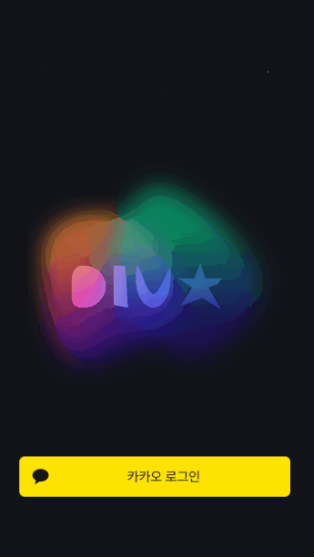
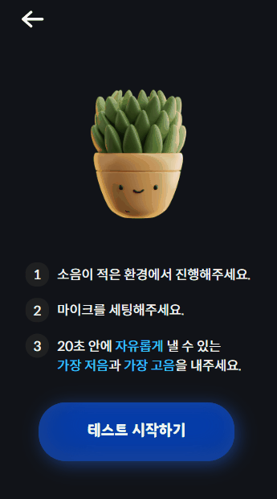
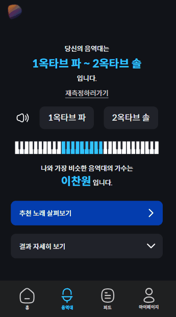
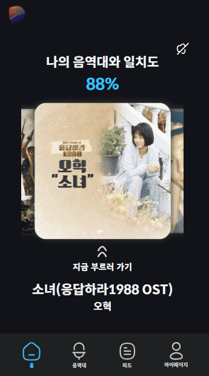
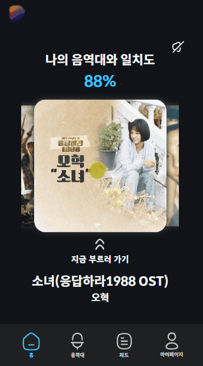
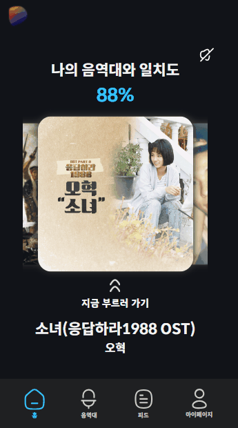
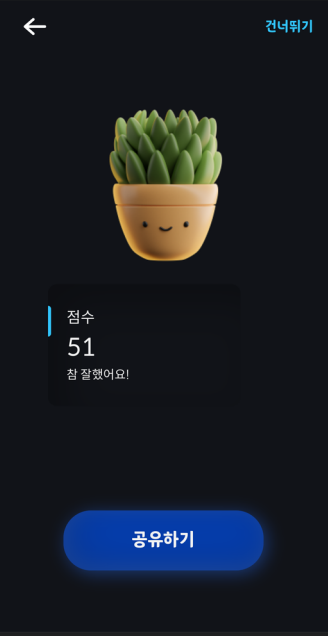
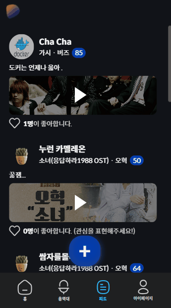
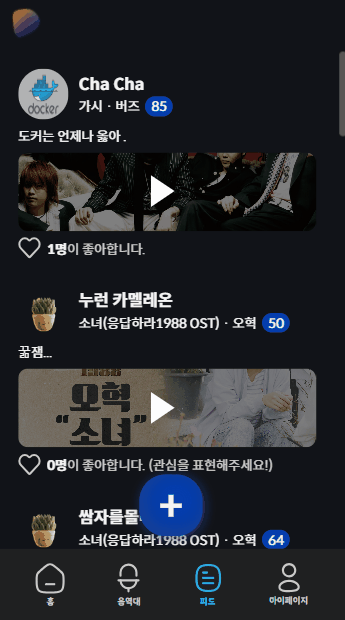

## 💬 프로젝트 소개

노래를 좋아하는 사람들이 **자신의 음역대에 맞는 노래를 찾고, 꾸준한 연습**을 통해 **더 나은 가창력**을 발휘할 수 있도록 돕는 서비스입니다.

## 🙋FE 팀원 소개

|  |  |  |
| :-------------------------------------------------------------------: | :------------------------------------------------------------------: | :---------------------------------------------------------------: |
|                 [류기현](https://github.com/geekseal)                 |                [박지영](https://github.com/parkyolo)                 |                [이근학](https://github.com/gnaak)                 |

## 🛠️기술 스택

- Next.js 14.0.4
- Typescript
- Tailwind CSS
- Jotai
- VSCode

## 🎬실행 방법

```jsx
// 패키지 라이브러리 설치
pnpm install

// 개발 환경 실행
pnpm run dev

// 빌드 파일 생성
pnpm run build
```

> **배포 주소 : https://divamusic.me**

## 🎮주요 기능

> 1️⃣ 사용자 음성 기반 음역 분석
>
> Web Audio API의 MediaStream을 통해 사용자 음성을 입력 받아 분석하고, 개인 음역의 특성을 제공합니다.

> 2️⃣ 노래 추천
>
> 분석된 음역대 정보를 기반으로 노래를 추천합니다.

> 3️⃣ 노래 부르기
>
> 음정과 가사 가이드를 통해 사용자가 노래를 연습할 수 있는 기능을 제공합니다.<br>튜토리얼 모드는 원하는 구간의 가사를 클릭하여 이동하며 연습할 수 있고, 실전 모드는 사용자가 부른 노래의 점수를 채점하고 기록합니다.

> 4️⃣ 피드 공유
>
> 실전 모드의 결과를 게시글 형태로 피드에 공유하여 다른 사용자들과 음악 경험을 공유하고, 소통할 기회를 제공합니다.

### 역할

- 🍪소셜 로그인, JWT - 류기현
- 🪝모달, 캐러셀, api 훅 제작 - 류기현
- 🛫랜딩 페이지 - 이근학, 박지영
  | 랜딩 페이지 |
  |:------------------------------------------------:|
  |  |
- 🌵음역대 테스트 가이드 - 류기현
- 🗣️음역대 테스트 - 이근학
  | 음역대 테스트 |
  |:------------------------------------------------:|
  |  |
- 📊음역대 결과 - 박지영
  | 음역대 결과 |
  |:------------------------------------------------:|
  |  |
- 🎠홈 화면 - 이근학, 류기현
  | 홈 화면 |
  |:------------------------------------------------:|
  |  |
- 🎙️노래 부르기 - 박지영
  | 튜토리얼모드 | 실전모드|
  |:------------------------------------------------:|:------------------------------------------------:|
  |  |  |
- 💯채점 결과 로딩 - 류기현
- 🎼채점 결과 - 박지영
  | 채점 결과 |
  |:------------------------------------------------:|
  |  |
- ☕피드 - 박지영
  | 피드 |
  |:------------------------------------------------:|
  |  |
- 🙍🏻마이페이지 - 이근학
- 📄업로드, 업데이트 폼 - 이근학, 박지영
  | 업로드, 업데이트 |
  |:------------------------------------------------:|
  |  |
- ⚙설정 - 류기현
- 📁폴더 구조 설계 - 박지영

```
.
├── public
│   ├── fonts
│   ├── images
│   └── svgs
├── src
│   ├── app
│   ├── components
│   ├── containers
│   ├── hooks
│   ├── services
│   ├── store
│   ├── styles
│   ├── types
│   └── utils
└── README.md
```
